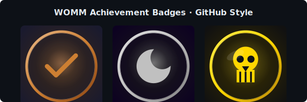

# WOMM — Works On My Machine

[](https://go.dev/)
[](LICENSE)

> **官方成就太无聊？WOMM 让每个开发者都能给自己的 README 挂上黑色幽默徽章。**

WOMM 是一个自托管的 GitHub 成就徽章生成服务。它提供 **25 枚源自社区文化的讽刺徽章**、**4 套高度风格化的视觉主题**，以及**通过真实 GitHub API 进行的社会实验式认证**——把 [rejected-github-profile-achievements](https://github.com/nickvdyck/rejected-github-profile-achievements) 的创意变成了一个真正可用的活服务。



---

## 为什么需要 WOMM？

- 🎭 **官方成就太"正经"** —— 研究表明 GitHub 官方成就与开发者真实技能相关性很差
- 🧑‍💻 **表达欲被压抑** —— 开发者想在 README 里展示更"人味儿"的个性
- 🔥 **静态创意无法落地** —— rejected-achievements 项目只有图片，没有真正可嵌入 README 的徽章

WOMM 填补了这个空白：徽章即服务，挂即用。

---

## 核心特性

### 🏆 25 枚徽章

| 类型 | 数量 | 示例 |
|------|------|------|
| **声明式**（想挂就挂） | 10 | 在我机器上能运行、已读不回、橡皮鸭调试大师 |
| **认证式**（API 自动验证） | 15 | 午夜编码者、PR 轰炸机、真·破坏王 |

每枚徽章都配有**中英双语**文案，以及一句"毒鸡汤"副标题。

### 🎨 4 套视觉主题

- **pixel**（默认） — CRT 绿色荧光终端，开发者共鸣感拉满
- **cyberpunk** — 霓虹粉蓝渐变 + 扫描线
- **glitch** — RGB 错位 + 故障艺术
- **clean** — 类 shields.io 简约风

### 🔍 4 种布局模板

`badge` / `wide` / `terminal` / `stamp` —— 同一徽章，四种呈现。

### ⚙️ 双模式交付

- **HTTP 服务** — `` 直接嵌入 README
- **CLI 生成** — `womm generate midnight-coder --theme=cyberpunk` 生成静态 SVG

---

## 快速开始

### 方式 1：Docker

```bash
docker build -t womm .
docker run -d -p 8080:8080 -v $(pwd)/data:/data --name womm womm
curl http://localhost:8080/api/badge/works-on-my-machine
```

### 方式 2：本地编译

```bash
go build -o womm .
./womm serve
# 在另一个终端：
curl http://localhost:8080/api/badge/works-on-my-machine?theme=pixel
```

---

## CLI 命令

```
womm serve                           启动 HTTP 服务
womm list                            列出全部 25 枚徽章
womm claim <badge-id> [--user=xxx]   声明获得一个"声明式"徽章
womm status [--user=xxx]             查看自己已解锁的徽章
womm generate <badge-id>             生成 SVG 静态文件
    --theme=pixel|cyberpunk|glitch|clean
    --style=badge|wide|terminal|stamp
    --lang=zh|en
    --output=path.svg
womm certify <badge-id> --user=xxx   尝试通过 GitHub API 认证某徽章
womm github-token [TOKEN]            设置/查看 GitHub Personal Access Token
```

通用标志：`-c, --config womm.toml` 指定配置文件路径。

---

## HTTP API

### `GET /api/badge/{id}`

渲染徽章 SVG。

| 参数 | 默认值 | 说明 |
|------|--------|------|
| `theme` | `pixel` | 视觉主题 |
| `style` | `badge` | 布局模板 |
| `lang`  | `zh`    | 语言（`zh`/`en`） |
| `user`  | —       | GitHub 用户名（认证式徽章必填） |

**嵌入 README：**

```markdown

```

### `GET /api/badges`

- 无参数：返回全部 25 枚徽章的 JSON 列表
- `?user=xxx`：返回该用户已解锁的徽章

### `GET /api/health`

返回 `{"status":"ok"}`。

---

## 配置

项目根目录的 `womm.toml`：

```toml
[server]
port = 8080
host = "0.0.0.0"

[storage]
path = "womm.db"

[github]
default_token = ""        # GitHub Personal Access Token（可选但推荐）
rate_limit_ttl = "1h"

[cache]
ttl = "1h"

[themes]
default = "pixel"
```

`default_token` 让认证式徽章可以真正验证 GitHub 数据。所需权限：`read:user`（公开数据）+ `repo`（如需查询私有仓库）。

---

## 认证式徽章的工作原理

每枚认证式徽章对应一个 `CertFunc`，根据真实 GitHub 数据判定：

| 徽章 | 触发规则 |
|------|---------|
| 午夜编码者 | 30%+ commits 在 02:00–05:00 |
| 周末战士 | 20%+ commits 在周六/周日 |
| PR 轰炸机 | 30 天内开 20+ PR |
| 猴子扳手 | 近期 PR 触发 CI 失败 |
| 真·破坏王 | 连续 3 次 CI 失败 |
| 幽灵提交者 | 连续消失 30 天后回归 |
| 百 Issue 之主 | 100+ open issues |
| ... | 详见 [设计文档](./docs/superpowers/specs/2026-06-09-womm-badge-service-design.md) |

认证结果缓存 1 小时（可配置）。

---

## 架构

```
womm (Go binary)
├── HTTP Server (chi)          ← GET /api/badge/{id}, /api/badges, /api/health
├── Render Engine              ← SVG 生成（html/template + 25 icons）
├── Certify Engine             ← 15 个 CertFunc + GitHubClient
├── Store (SQLite)             ← badge_state + cert_cache
└── CLI (cobra)                ← serve / list / claim / certify / generate / ...
```

---

## 开发

```bash
# 拉取依赖
go mod download

# 运行全部测试
go test ./...

# 静态分析
go vet ./...

# 构建
go build -o womm .
```

**测试覆盖的模块：** config、badge、store、certify（functions + engine）、render、server。

---

## 徽章列表

<details>
<summary>点击展开全部 25 枚徽章</summary>

### 声明式（10 枚）

| ID | 名称 | 毒鸡汤 |
|----|------|--------|
| `works-on-my-machine` | 在我机器上能运行 | 态度即正义 |
| `read-not-reply` | 已读不回 | Review 了你的 PR，然后…没有然后了 |
| `stackoverflow-courier` | Stack Overflow 搬运工 | 代码从网上来，到网上去 |
| `todo-collector` | TODO 收藏家 | `// TODO: fix this later` × 50 |
| `comment-fundamentalist` | 注释原教旨主义者 | 每行代码配三行注释，包括 i++ |
| `copy-paste-engineer` | 复制粘贴工程师 | Ctrl+C / Ctrl+V 是核心技能 |
| `rubber-duck-master` | 橡皮鸭调试大师 | 对着鸭子说话就能修 bug |
| `no-friday-deploy` | 周五不部署 | 血的教训换来的铁律 |
| `force-push-warrior` | Git Force Push 勇士 | --force 是我的日常 |
| `meeting-survivor` | 会议幸存者 | 今天开了 6 个会，写了 0 行代码 |

### 认证式（15 枚）

| ID | 名称 | 触发规则 |
|----|------|---------|
| `midnight-coder` | 午夜编码者 | 30%+ commits 在 02:00–05:00 |
| `weekend-warrior` | 周末战士 | 20%+ commits 在周六/周日 |
| `issue-lord` | 百 Issue 之主 | 100+ open issues |
| `docs-master` | 文档仙人 | README 长、代码短 |
| `pr-bomber` | PR 轰炸机 | 30 天内 20+ PR |
| `monkey-wrench` | 猴子扳手 | 近期 PR 触发 CI 失败 |
| `archaeologist` | 考古学家 | 修改了 3+ 年前未动过的文件 |
| `branch-hoarder` | 分支囤积者 | 活跃分支 > 15 |
| `ghost-committer` | 幽灵提交者 | 消失 30 天后回归 |
| `polyglot` | 多语言通才 | 使用 5+ 编程语言 |
| `true-destroyer` | 真·破坏王 | 连续 3 次 CI 失败 |
| `y2k-hunter` | 千年虫猎人 | 接触 1999/2000 代码 |
| `life-404` | 404 人生 | 个人主页为空 |
| `commit-anniversary` | 首次提交纪念日 | 首次 commit ≥ 5 年 |
| `fullstack-victim` | 全栈受害者 | 前端 + 后端 + DevOps 仓库都有 |

</details>

---

## 路线图

- [ ] 插件化徽章系统（用户自定义 CertFunc）
- [ ] OAuth 登录流程（多用户支持）
- [ ] 徽章收藏 / 分享
- [ ] 更多视觉主题（retro-arcade、watercolor）
- [ ] Web UI：交互式徽章墙

---

## 灵感来源

- [rejected-github-profile-achievements](https://github.com/nickvdyck/rejected-github-profile-achievements)
- [shields.io](https://shields.io/)
- GitHub 官方成就系统的社区讨论

---

## License

MIT — 详见 [LICENSE](LICENSE)。
